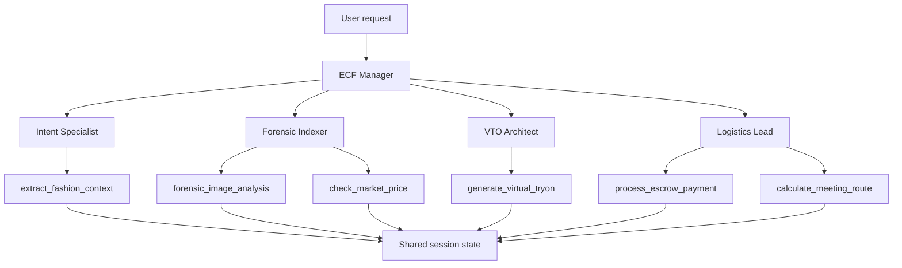

# Multi-Agent Fashion OS

A production-oriented prototype for multi-agent commerce orchestration in second-hand fashion.

This is not another Streamlit wrapper or a generic fashion chatbot. It is a multi-agent system where a root manager delegates specialized tasks to domain agents, each supported by deterministic business tools and governance callbacks.

The fashion use case is the surface. The real value is the architecture: a reusable agentic workflow for high-trust digital commerce, where trust, fit, fraud, pricing and transaction safety must be handled as separate decision layers.

---

## Business Context

Second-hand fashion marketplaces do not only have a discovery problem. They have a trust problem.

A buyer needs to know:

- whether the garment fits the event and context,
- whether the image looks real,
- whether the size is likely to work,
- whether the price is fair,
- whether the transaction can happen safely.

Multi-Agent Fashion OS addresses this through a controlled multi-agent architecture instead of relying on a single LLM to reason about everything at once.

---

## Forensic Analysis: The Hidden Asset

The strongest part of this repository is the forensic decision layer.

The system includes a specialized agent for garment analysis, supported by tools that evaluate image validity, wear level, fit signals, brand authenticity and price logic.

That matters because second-hand fashion commerce depends on confidence. A marketplace that cannot detect risk, inconsistency or fraud will eventually lose user trust.

This project demonstrates how AI agents can be used not just for conversation, but for structured decision workflows in vertical commerce.

---

## Architecture Overview



---

## System Design

### 1. Manager Agent

`manager/ecf_manager.py`

The root agent acts as the orchestrator. It does not own the full business process. Its responsibility is to interpret the user request and route the workflow to the right specialized agent.

This avoids the classic failure mode of LLM applications: one oversized assistant trying to reason, calculate, validate and decide everything at the same time.

---

### 2. Specialized Sub-Agents

The system is divided into four agents with strict operational boundaries.

| Agent | Responsibility | Output Key |
|---|---|---|
| `ecf_intent_specialist` | Understands the user's event, climate and style context | `context_analysis` |
| `ecf_forensic_indexer` | Analyzes garment image, wear level, measurements, authenticity and market price | `forensic_report` |
| `ecf_vto_architect` | Evaluates fit risk and virtual try-on logic | `vto_result` |
| `ecf_logistics_lead` | Handles escrow simulation and meeting-point coordination | `transaction_complete` |

This is a multi-agent system, not a linear prompt chain.

---

### 3. Tool Layer

`tools/fashion_tools.py`

The agents do not perform all actions directly. They call explicit Python tools with typed arguments, guard clauses and structured return contracts.

Each tool returns either:

```python
{"status": "success", ...}
```

or:

```python
{"status": "error", "mensaje": "..."}
```

This makes the system easier to test, debug and replace with production integrations.

---

### 4. Security & Governance Callbacks

`tools/callbacks.py`

The repository includes callback-based control layers:

- session validation before agent execution,
- prompt-injection blocking logic,
- avatar measurement injection before virtual try-on reasoning,
- fraud screening before forensic image analysis.

This demonstrates a key production principle: critical safety logic should not live only in prompts. It should be enforced in code.

---

## Repository Structure

```text
.
├── main.py
├── manager/
│   └── ecf_manager.py
├── sub_agents/
│   ├── agent_1/agent_1.py
│   ├── agent_2/agent_2.py
│   ├── agent_3/agent_3.py
│   └── agent_4/agent_4.py
├── tools/
│   ├── callbacks.py
│   └── fashion_tools.py
├── tests/
│   └── test_fashion_tools.py
├── docs/
│   └── architecture.md
├── .github/workflows/tests.yml
├── .env.example
├── requirements.txt
├── pyproject.toml
└── README.md
```

---

## Current Prototype Scope

This repository currently uses mocked integrations to demonstrate the orchestration pattern.

| Component | Current Status | Production Replacement |
|---|---|---|
| Context and weather logic | Mocked | Weather API + semantic parser |
| Garment image analysis | Mocked | Vision API / OCR / multimodal model |
| Market price validation | Mocked | Vinted / Wallapop / marketplace data |
| Virtual try-on | Mocked | Vertex AI Imagen / virtual try-on model |
| Escrow payment | Mocked | Stripe / Mangopay / payment provider |
| Meeting route | Mocked | Maps API |

This should be presented as a production-oriented prototype, not as a finished production marketplace.

---

## How to Run

### 1. Create a virtual environment

```bash
python -m venv .venv
source .venv/bin/activate
```

### 2. Install dependencies

```bash
pip install -r requirements.txt
```

### 3. Configure environment variables

```bash
cp .env.example .env
```

Add your Google API key to `.env`:

```bash
GOOGLE_API_KEY=your_api_key_here
```

### 4. Run the demo

```bash
python main.py
```

---

## Testing

The deterministic tool layer can be tested independently from the LLM orchestration layer.

```bash
pytest
```

The current tests validate guard clauses, successful outputs and critical business contracts for the fashion tools.

---

## Operational Value

### Multi-Agent Orchestration

The project demonstrates a manager/sub-agent architecture where specialized agents own specific parts of the workflow.

### Vertical AI System Design

The system is not generic. It is built around domain-specific commerce problems: garment trust, fit validation, price confidence, fraud screening and secure transaction flow.

### Modularity

Agents, tools and callbacks are separated. This makes the system easier to extend without rewriting the whole workflow.

### Reliability

Business logic lives in deterministic Python tools. The LLM is used for orchestration and communication, not as the only source of operational truth.

### Governance

Security checks are enforced before agent and tool execution through callbacks, reducing the risk of prompt injection and fraudulent input.

---

## Why This Project Belongs in an AI Portfolio

This repository demonstrates that the builder can design complex, non-linear AI systems.

It shows:

- multi-agent orchestration,
- separation between agents and tools,
- domain-specific tool design,
- deterministic business logic,
- safety callbacks,
- structured session state,
- testable AI-adjacent components,
- a real commercial use case beyond a chatbot interface.

A junior AI project wraps an LLM in a UI.

A senior AI systems project designs the operating logic around the LLM.

This repository belongs in the second category.
